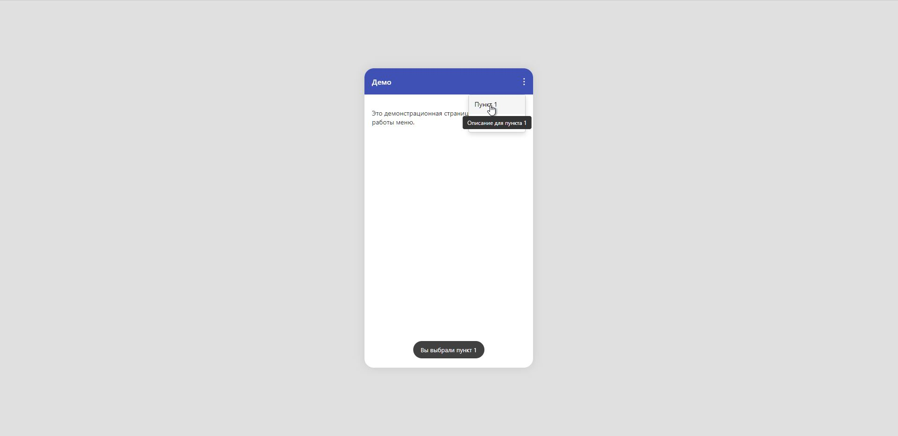
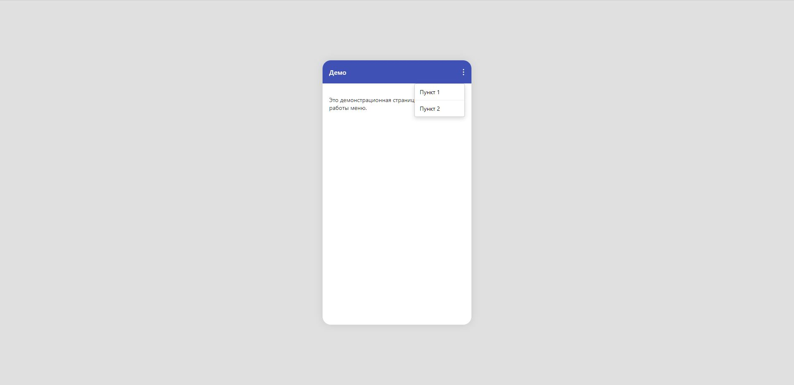
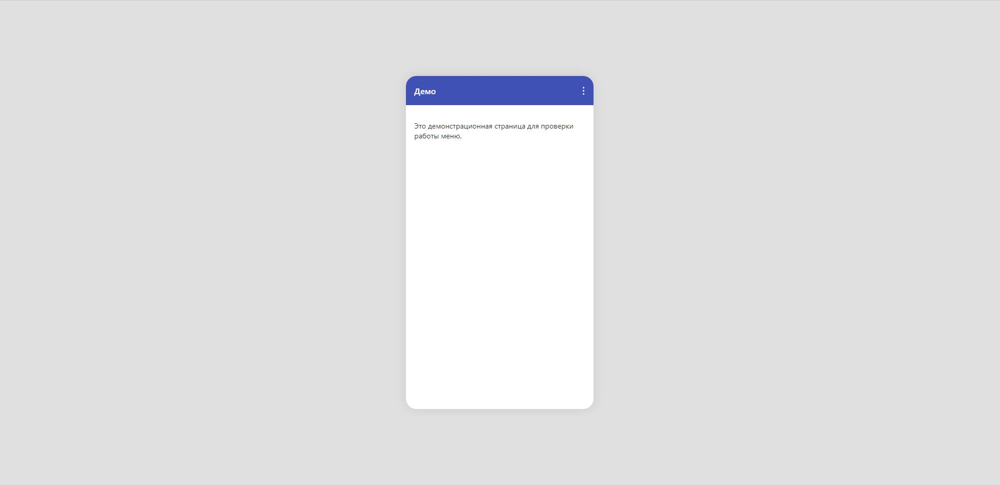

# Telegram-Style Menu

Мини-проект демонстрирует реализацию **меню в стиле Telegram** — три точки в правом верхнем углу с интерактивными всплывающими подсказками и реакцией на клики.

## ✨ Основные возможности

- Меню с тремя точками, как в Telegram  
- Всплывающие подсказки при наведении  
- Реакция на клики по пунктам меню  
- Минималистичный интерфейс и плавная анимация  
- Полностью на чистом HTML, CSS и JavaScript  

---

## 🧰 Используемые технологии

- **HTML5** — структура страницы  
- **CSS3** — стили, эффекты, анимации  
- **JavaScript (Vanilla)** — логика меню и подсказок  

---

## 🚀 Демо

🔗 [Посмотреть онлайн на GitHub Pages](https://hoadf.github.io/telegram-style-menu/)  
💾 [Исходный код на GitHub](https://github.com/hoadf/telegram-style-menu)

---

## 📸 Скриншоты

| Меню открыто | Общий вид |
|--------------|------------------------|
|  |  |

---
